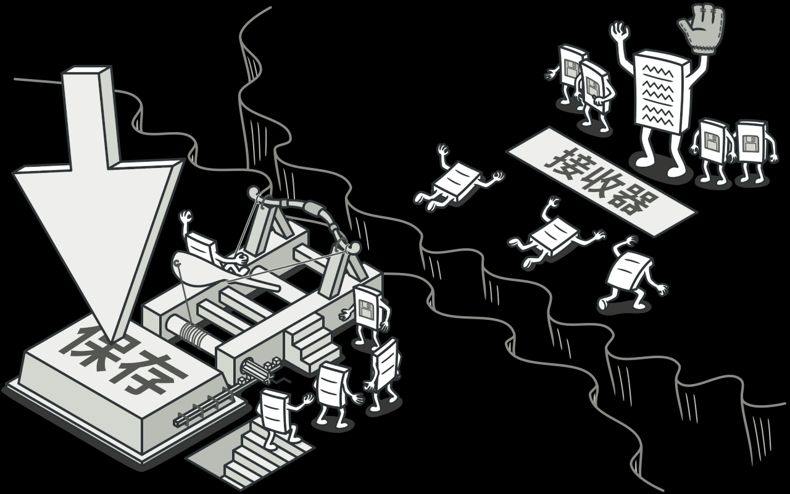

# 基于状态切换的撤销和重做

之前在开发地图编辑器的时候，对编辑器的撤销和重做有一些思考，撤销和重做功能在编辑类的软件中广泛存在。其实现各不一致，但思路大都差不多，此文介绍的是基于状态切换的撤销和重做



考虑如下的场景，我们在地图上添加了一个矩形记作操作 A,类似进行操作，得到 $B C D E F$ 状态

整个的操作序列是 $A → B → C → D → E → F$
如果我们想要回到最开始的状态，最朴素的想法反向操作，例如 F 操作添加了一个圆形，删除了就相当于撤销了 E 操作。将删除操作记作 F 状态的逆向操作 $\^F$
如果要回到 $A$ 操作

$$
\begin{align}
& A B C D E F \cdot \^F\\
& A B C D E  \cdot \^E\\
& A B C D  \cdot\^D\\
& A B C  \cdot\^C\\
& A B \cdot \^B\\
& A
\end{align}
$$
同样如果要恢复被撤销的操作，重新执行一下即可
$$
\begin{align}
& A  \\
& A B \\
& A B C \\
& A B C D \\
& A B C D E \\
& A B C D E F \\
\end{align}
$$

## 基于数据快照重建当前状态
最简单的做法是每次操作都保存一个状态，比如我添加了一个圆形，一个矩形 $S_A$(圆形) $S_B$(圆形 矩形)。第一次生成状态A，第二次生成状态B

$S_A = \{c\}$

$S_B = \{c, r\}$

从$A \Rightarrow B$ 或者 从$B \Rightarrow A$ 每次将地图上的所有元素全部移出然后基于状态重新添加进来。我想从B切换到A状态，就把地图上的所有元素全部删除，根据A状态的数据重新添加进来一个圆形

## 基于快照+快照diff


上面这样做当然是可行的，但是显然全部移出再全部添加不够高效。因为$S_A$和$S_B$都有一个相同的圆形，没有必要删除然后又添加回来。可以为这些元素生成一个唯一标识，对比两个$S_A$和$S_B$状态，发现只有矩形$r$是状态B所特有的，那么如果是从$A \Rightarrow B$，就会执行添加矩形$r$操作，如果是$B \Rightarrow A$就会执行删除矩形$r$操作

再次分析一下上面所说的两个步骤
1. 对比状态，标记特定元素为删除/添加/替换
2. 执行操作

代码如下

```ts
function diff(StateA, StateB) {
  //  TODO
  return {
    removed,
    added,
    edited,
  }
}
```

